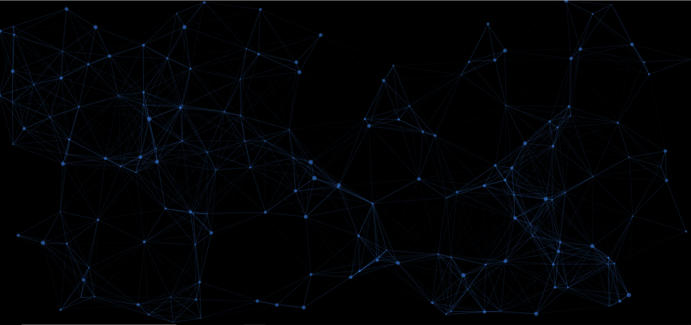

# particles
利用particles.js实现粒子动画效果

[demo](https://lavendergirl.github.io/particles/index.html)

### `Options配置说明`

key | option type / notes | example | 
----|---------|------
`particles.number.value` | number /数量 | `40`
`particles.number.density.enable` | boolean | `true` / `false` 
`particles.number.density.value_area` | number/区域散布密度大小 | `800`
`particles.color.value` | HEX (string)   RGB (object)   HSL (object)   array selection (HEX)   random (string) 原子的颜色 | `"#b61924"`   `{r:182, g:25, b:36}`    `{h:356, s:76, l:41}`   `["#b61924", "#333333", "999999"]`   `"random"`
`particles.shape.type` | string   array selection 原子的形状 | `"circle"`   `"edge"`   `"triangle"`   `"polygon"`   `"star"`   `"image"`   `["circle", "triangle", "image"]`
`particles.shape.stroke.width` | number/原子的宽度 | `2`
`particles.shape.stroke.color` | HEX (string)/原子颜色 | `"#222222"`
`particles.shape.polygon.nb_slides` | number/原子的多边形边数 | `5`
`particles.shape.image.src` | path link   svg / png / gif / jpg 原子的图片可以使用自定义图片 | `"assets/img/yop.svg"`   `"http://mywebsite.com/assets/img/yop.png"`
`particles.shape.image.width` | number  (for aspect ratio)图片高度 | `100`
`particles.shape.image.height` | number  (for aspect ratio)图片高度 | `100`
`particles.opacity.value` | number (0 to 1)不透明度 | `0.75`
`particles.opacity.random` | boolean随机不透明度 | `true` / `false` 
`particles.opacity.anim.enable` | boolean渐变动画 | `true` / `false` 
`particles.opacity.anim.speed` | number渐变动画速度 | `3`
`particles.opacity.anim.opacity_min` | number (0 to 1)渐变动画不透明度 | `0.25`
`particles.opacity.anim.sync` | boolean | `true` / `false`
`particles.size.value` | number 原子大小 | `20`
`particles.size.random` | boolean 原子大小随机 | `true` / `false` 
`particles.size.anim.enable` | boolean原子渐变 | `true` / `false` 
`particles.size.anim.speed` | number原子渐变速度 | `3`
`particles.size.anim.size_min` | number | `0.25`
`particles.size.anim.sync` | boolean | `true` / `false`
`particles.line_linked.enable` | boolean 连接线 | `true` / `false`
`particles.line_linked.distance` | number连接线距离 | `150`
`particles.line_linked.color` | HEX (string)连接线颜色 | `#ffffff`
`particles.line_linked.opacity` | number (0 to 1)连接线不透明度 | `0.5`
`particles.line_linked.width` | number 连接线宽度 | `1.5`
`particles.move.enable` | boolean 原子移动 | `true` / `false`
`particles.move.speed` | number 原子移动速度 | `4`
`particles.move.direction` | string 原子移动方向 | `"none"`   `"top"`   `"top-right"`   `"right"`   `"bottom-right"`   `"bottom"`   `"bottom-left"`   `"left"`   `"top-left"`
`particles.move.random` | boolean 原子移动随机方向 | `true` / `false`
`particles.move.straight` | boolean 直接移动 | `true` / `false`
`particles.move.out_mode` | string   (out of canvas) 是否移动出画布 | `"out"`   `"bounce"`
`particles.move.bounce` | boolean   (between particles) 是否跳动移动 | `true` / `false`
`particles.move.attract.enable` | boolean 原子之间吸引 | `true` / `false`
`particles.move.attract.rotateX` | number 原子之间吸引X水平距离 | `3000`
`particles.move.attract.rotateY` | number Y垂直距离 | `1500`
`interactivity.detect_on` | string  原子之间互动检测| `"canvas", "window"`
`interactivity.events.onhover.enable` | boolean 悬停 | `true` / `false`
`interactivity.events.onhover.mode` | string   array selection 悬停模式 | `"grab"`   `"bubble"`   `"repulse"`   `["grab", "bubble"]`
`interactivity.events.onclick.enable` | boolean 点击效果 | `true` / `false`
`interactivity.events.onclick.mode` | string   array selection 点击效果模式 | `"push"`   `"remove"`   `"bubble"`   `"repulse"`   `["push", "repulse"]`
`interactivity.events.resize` | boolean 互动事件调整| `true` / `false`
`interactivity.events.modes.grab.distance` | number 原子互动抓取距离 | `100`
`interactivity.events.modes.grab.line_linked.opacity` | number (0 to 1) 原子互动抓取距离连线不透明度 | `0.75`
`interactivity.events.modes.bubble.distance` | number 原子抓取泡沫效果之间距离 | `100`
`interactivity.events.modes.bubble.size` | number 原子抓取泡沫效果之间大小| `40`
`interactivity.events.modes.bubble.duration` | number   (second) 原子抓取泡沫效果之间的持续事件 | `0.4`
`interactivity.events.modes.repulse.distance` | number 击退效果距离 | `200`
`interactivity.events.modes.repulse.duration` | number   (second)  击退效果持续事件| `1.2`
`interactivity.events.modes.push.particles_nb` | number 粒子推出的数量 | `4`
`interactivity.events.modes.push.particles_nb` | number | `4`
`retina_detect` | boolean | `true` / `false`

配置请参考：https://www.cnblogs.com/wangyihong/p/8618305.html
